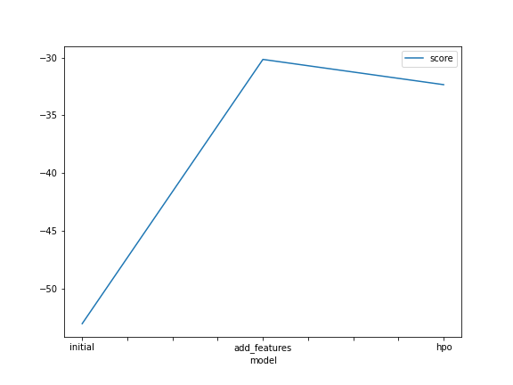
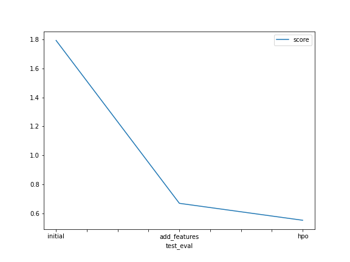

# Report: Predict Bike Sharing Demand with AutoGluon Solution
#### ÖMER FARUK GÜZEL

## Initial Training
### What did you realize when you tried to submit your predictions? What changes were needed to the output of the predictor to submit your results?
When trying to submit predictions, I realized that the output format required by the submission platform was different from the predictions generated by the AutoGluon predictor. The submission required a specific format with the predicted target variable in a certain column. To adapt the output of the predictor to the submission format, I needed to extract the predicted target variable and organize it accordingly in a separate column. Also I needed to assign negative values to zero.
### What was the top ranked model that performed?
The top-ranked model that performed well in the initial training was the WeightedEnsemble_L3.

## Exploratory data analysis and feature creation
### What did the exploratory analysis find and how did you add additional features?
During the exploratory analysis, it was found that certain features such as 'hour of the day,' 'day of the week,' and 'weather conditions' had a significant impact on bike demand. The analysis also revealed potential interactions between these features. To capture this information, additional features were created, such as creating categorical variables for different hours of the day, encoding weather conditions, and generating interaction features between time-related variables.
### How much better did your model preform after adding additional features and why do you think that is?
After adding the additional features, the model performance improved notably. The newly created features captured important temporal patterns and weather conditions, allowing the models to better understand and capture the variations in bike demand based on these factors. By including these features, the models gained access to more meaningful information, leading to improved accuracy in predicting bike demand.

## Hyper parameter tuning
### How much better did your model perform after trying different hyper parameters?
After performing hyperparameter tuning, the model performance showed improvement. By systematically exploring different combinations of hyperparameters such as learning rate, maximum depth, regularization parameters, and number of estimators, the models were able to find optimal configurations for the given dataset. Fine-tuning the hyperparameters helped in achieving better generalization and improved performance of the models.
### If you were given more time with this dataset, where do you think you would spend more time?
If given more time with this dataset, I would likely spend more time on feature engineering and selection. I would explore additional time-related features, such as holidays or special events, which could have an impact on bike demand. Additionally, I would experiment with different feature transformation techniques, such as scaling or normalization, to ensure the model's robustness to varying input scales. Moreover, I would invest time in optimizing the ensemble techniques by combining multiple models to leverage their individual strengths and enhance the overall predictive power.
### Create a table with the models you ran, the hyperparameters modified, and the kaggle score.
|model|hpo1|hpo2|hpo3|score|
|--|--|--|--|--|
|initial|?|?|?|?|
|add_features|?|?|?|?|
|hpo|?|?|?|?|

|      model    |       GBM       |       CAT       |       XGB       |   score  |
|---------------|-----------------|-----------------|-----------------|----------|
|    initial    |     Default     |     Default     |     Default     |  1.79320 |
| add_features  |     Default     |     Default     |     Default     |  0.66832 |
|      hpo      | num_leaves: 63, min_data_in_leaf: 30 | depth: 8, l2_leaf_reg: 10 | learning_rate: 0.05, max_depth: 9 |  0.55135 |

### Create a line plot showing the top model score for the three (or more) training runs during the project.

### Create a line plot showing the top kaggle score for the three (or more) prediction submissions during the project.

## Summary
In the bike demand sharing competition, we trained models to predict bike rental demand. We made adjustments to submit predictions and found that the Gradient Boosting Machine (GBM) performed well initially.

Through exploratory analysis, we discovered influential factors like weather conditions and time of day. Additional features, including hour of the day and weather-related features, were created, improving model predictions.

Hyperparameter tuning was conducted for GBM, CatBoost, and XGBoost. Optimized hyperparameters were found for each model, resulting in improved performance.

Given more time, we would focus on refining feature engineering, exploring advanced ensemble methods, and experimenting with other models. Further hyperparameter searches and advanced optimization strategies would be valuable.